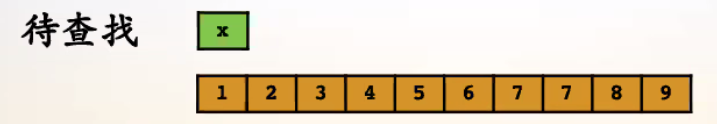
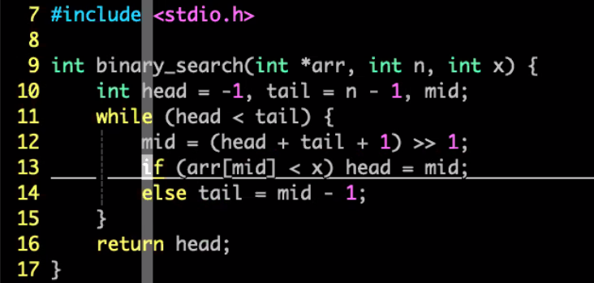

# 如何查找元素

现有一个单调数组，和一个待查找的元素x，如何何种查找法具有最好的时间复杂度。



最简单，也是最容易想到的方法是一个一个在数组里查找。但如果该数组长度为1亿的话，我们就需要查找1亿次，效率不好。


# 二分查找





# 附加1：0，1问题

假设有如下一个数组：
$$
0, 0, 0, ... , 0, 0, 1, 1, 1, 1, ...
$$
如何找到第一个1？


## 二分法

left `<` right:

**mid = (left + right) / 2**

mid -> 0 : left = mid + 1

mid -> 1 : right = `mid`


```c++
int bs01(int *arr, int left, int right, int target) {
    int mid;
    while (left < right) {
        mid = (left + right) >> 1;
        if (arr[mid] == 1) {
            right = mid;
        }
        else {
            left = mid + 1;
        }
    }
    
    return left;
}
```


# 附加2：1，0问题

假设有如下一个数组：
$$
1, 1, 1, 1, 0, 0, 0, 0, ...
$$
如何找到最后一个1？


## 二分法

left < right:

**mid = (left + right + 1) / 2** 

mid -> 1 : left = mid

mid -> 0 : right = mid - 1

```c++
int bs01(int *arr, int left, int right, int target) {
    int mid;
    while (left < right) {
        mid = (left + right + 1) / 2;
        if (arr[mid] == 0) {
            left = mid;
        }
        else {
            right = mid - 1;
        }
    }
    
    return left;
}
```

